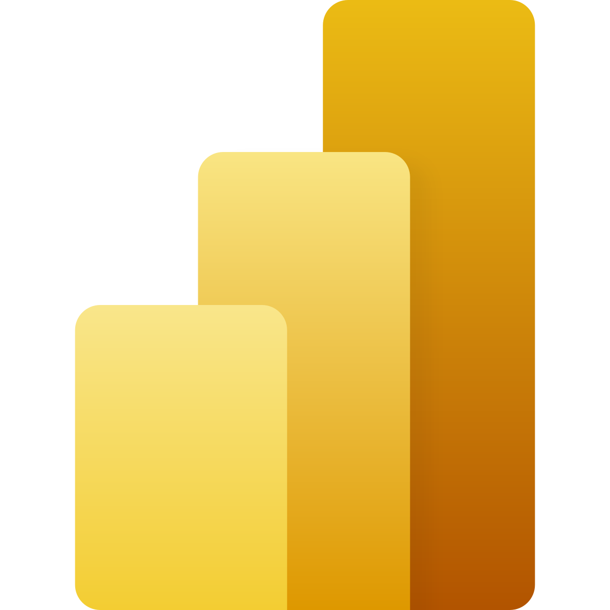

# About

I'm currently a student at the University of Massachusetts, Amherst studying Computer Science. I have a passion for fullstack development, cloud computing platforms, and 3D design. But I'm still exploring new technologies and trying new things! Outside of school, I like to listen to music, play pool, and occasionally woodwork. Check out my hobbies [here](/hobby).



## Work Experience 💼




This is my first internship! I I work under the Gas Pipeline Safety and Compliance department at the National Grid which is a utility company that operates in the UK, New York, and New England. My main tasks include working on an internal app for field workers and creating reports in PowerBI.

<h4>Tools and Technologies</h4>

    </img>
    </img>
    </img>





## Education 🎓



I'm currently at UMass studying computer science. This past year I participated in <a href="https://hackumass.com/">HackUMass XI</a> and joined <a href="https://buildumass.com/">BuildUMass</a>. This upcoming year I will be a UCA for <a href="https://people.cs.umass.edu/~liberato/courses/2022-fall-compsci230/syllabus/">CS230 Computer Science Principles</a>. 



I was dual enrolled at WPI my senior year of high school at the <a href="https://www.massacademy.org/">Massachusetts Academy of Math and Sciences</a>.




## Certifications 🏅

